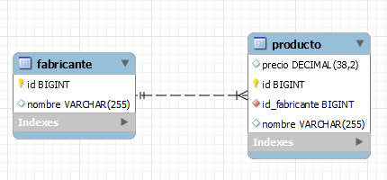
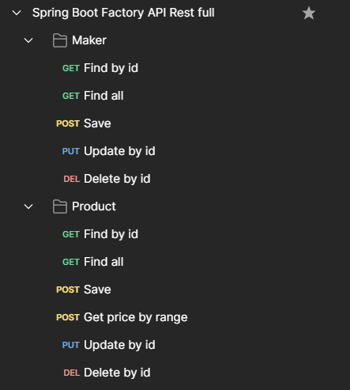

# Spring Boot API Rest full

API Rest full Sistema de frabrica , usando Spring Boot como framework de Java, JPA, Hibernate
Lombok, arquitectura de carpetas y usando querys JPQL

## Diagrama DER

## Coleccion de postman
